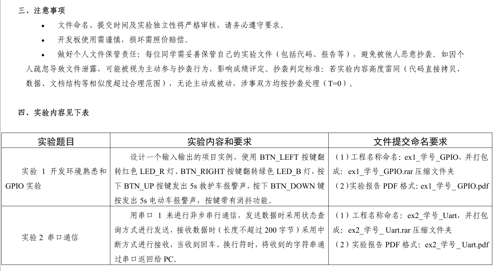

# 南京理工大学嵌入式系统课程作业及实验通关秘籍

## 22计算机科学与技术刘宇翔 

**砍下嵌入式系统90分（后因软工赋分太低导致卷子全体复核降为85分）**

## 嵌入式系统课程分数组成————计科班夏青元老师

**作业10%+实验40%+开卷考试（全开卷，可带任何纸质资料）50%**

**作业6个+实验7个；其中实验的七个项目需要到院办进行答辩，答辩过关方视为拿到这部分平时分**

**我的实验7的三个任务是分开做的，合着做尝试过没实现得了，暂时这样了**

**鸣谢我的舍友李思杰，他提供了大部分项目的构建思路并给予我的嵌入式作业一定帮助**

**选课老师推荐夏老师，给分很好，另外两名李姓老师一个压分特别狠一个额外要求比较多**

## 嵌入式系统实验要求合集

## 嵌入式系统作业要求合集

### 嵌入式系统作业1——GPIO

1. 题目设计要求  

   ​	熟悉开发板功能，完成通过按键控制LED灯的亮灭：按下“RIGHT”键，两个 LED 灯同时亮，否则两个LED灭！ 

2. 拟实现的具体功能  

   ​	当开发板通电的时候，两个LED灯默认不亮，按下right键时两个LED灯同时 亮，松开的时候两个LED灯同时灭，完成本次gpio实验功能。 

### 嵌入式系统作业2——矩阵键盘扫描 

1. 题目设计要求  

【1】作业目标：  

（1）熟悉嵌入式系统的寄存器工作原理；  

（2）能够熟练掌握寄存器的STM32嵌入式程序开发；  

（3）独自完成矩阵键盘的扫描程序功能。  

【2】作业内容：  基于寄存器方法的完成教材P121,图6-4的矩阵键盘的扫描程序开发。  

【3】完成要求：  

（1）基于寄存器库开发，不得使用HAL库； 

（2）变成矩阵键盘的行列扫描功能，编制键码值生成程序，将按键K1-K12， 分别对应1-0x0C值，有按键按下一次时，调试串口输出响应的键码值；

（3）对按键具有软件消抖处理；  

（4）程序代码附有必要的注释，并且编译通过无错，无须在开发板上测试。  

2. 拟实现的具体功能

   ​	完成基于寄存器库开发的，能够实现矩阵键盘的行列扫描功能，编制键码值 并生成程序，将对应的按键的键码值调整好，从而调试串口输出响应的键码值， 并加入软件消抖处理，编译程序通过。

### 嵌入式系统作业3——LCD

1. 题目设计要求  

【1】作业目标：  

（1）熟悉FSMC工作原理；  

（2）能够熟练掌握FSMC嵌入式程序开发；  

（3）独自完成LCD、字库、图形、字模使用方法。  

【2】作业内容：  设计程序将自己的中文姓名、学号和证据照显示在LCD屏上。  

【3】完成要求：  

（1）工程名称命名为：学号_lcd;  

（2）学号 每隔1分钟自动换一个颜色  

（3）中文姓名显示采用跑马形式形式，从左向右移动，正好5秒移动完后， 从左再此循环显示；  

（4）中文姓名不得用图片形式，须由字模生成；  

（5）程序代码附有必要的注释，在开发板上完成验证。 

2. 拟实现的具体功能  

   ​	完成基于FSMC开发的，通过使用相关工具独自完成LCD、字库、图形、字模 使用方法，编程实现本实验任务，编译通过后下载程序到开发板上，能够成功在 LCD 上展现个人的学号、姓名以及证件照的内容，完成实验要求。

### 嵌入式系统作业4——gpio_intr

1. 题目设计要求  

【1】作业目标：  

（1）熟悉中断工作原理；  

（2）能够熟练外部中断开发编程；  

（3）能够使用中断函数。  

【2】作业内容：  

设计一个输入输出的综合项目实例，使用BTN_LEFT按键翻转红色LED_R灯、  BTN_RIGHT 按键翻转蓝色 LED_B 灯，按下 BTN_UP 按键发出 5s 救护车报警声， 按下BTN_DOWN键按发出5s电动车报警声。  

【3】完成要求：  

（1）工程名称命名为：学号_gpio_intr；  

（2）采用中断的方式检测按键状态，且按键带有消抖功能； 

（3）作业提交：实验报告、工程和运行结果拍摄视频压缩后QQ上提交， 压缩文件名称为“学号_姓名_gpio_intr”，不按要求进行命名的，该实验或作业没 有分。 

2. 拟实现的具体功能  

   完成基于STM32CubeMX 硬件设计平台实现的基于方向键加以中断实现对应 的LED灯输出，使用BTN_LEFT按键翻转红色LED_R灯、 BTN_RIGHT按键翻转蓝 色LED_B灯，按下BTN_UP按键发出5s救护车报警声，按下BTN_DOWN键按发 出5s电动车报警声。

### 嵌入式系统作业5——SPI

1. 题目设计要求  

【1】作业目标：  

（1）熟悉SPI工作原理；  

（2）能够熟练SPI开发编程；  

（3）能够使用FLASH进行数据读写。  

【2】作业内容：  分别使用两种方法对开发板上的 W25Q64 进行读写，通过按键切换两种模式： 

（1）按下KEY_LEFT 键，处于 SPI 读写模式采用，SPI 部件对 W25Q64 的读写； 

（2）按下KEY_RIGHT键，处于模拟SPI读写模式，采用GPIO管脚模拟SPI时序 对W25Q64的读写；  以上两种方法均完成对W25Q64的初始化、数据写入和读出数据并开展校验，并 分别计算出在读和写的速度（MB/s），并显示在LCD屏上。  

【3】完成要求：  

（1）两模式模式都要有，并且能自由切换，读写模式显示在LCD上，否则不给 分；  

（2）在不同模式下，都能对读写数据完成数据校验，并给出结果写LCD上；  

（3）在不同模式下，分别完成读写速度测试，统计出读和写的速度结果写 LCD 上； 

2. 拟实现的具体功能  

   ​	本实验旨在实现两种SPI读写模式下对W25Q64 FLASH进行数据的初始化、 写入、读取和校验，并在LCD屏上实时显示操作模式、数据校验结果以及读写速 度。具体功能包括：  

   ​	首先，通过硬件按键控制实现两种不同的读写模式切换。当用户按下 KEY_LEFT 按键时，系统进入基于SPI外设模块的读写模式，利用MCU内置SPI模 块直接与W25Q64通信；当用户按下KEY_RIGHT按键时，系统则切换为利用GPIO 管脚模拟SPI时序的方式进行FLASH操作。两种模式均能实时显示当前模式信息 于LCD屏上，确保用户能够直观识别当前的操作状态。  

   ​	其次，在每种模式下，系统首先对W25Q64进行初始化，配置相应的寄存器 1  和通信参数，确保FLASH处于可读写状态。接着系统进行数据写入操作，将预设 的数据写入FLASH中，再进行数据读取操作以将写入的数据从FLASH中取出。读 取的数据将与预先写入的数据进行逐一比对，实现数据校验功能。校验结果（成 功或失败）会在LCD屏上明确显示，为后续调试和验证提供直观依据。 

   ​	最后，系统在两种模式下还将分别进行读写速度测试。通过对数据传输过程 计时，并计算出读写的传输速率（单位为MB/s），这些测试数据同样会在LCD屏 上实时更新显示，供用户参考比较。整体系统设计要求操作模式切换灵活、数据 传输准确、校验有效、显示直观，以便用户能全面评估两种SPI实现方案的优缺 点，并对FLASH存储器的性能有直观了解。

### 嵌入式系统作业6——I2CICM

1. 题目设计要求  

【1】作业目标：  

（1）熟悉I2C工作原理；  

（2）能够熟练I2C开发编程；  

（3）掌握数据滤波方法和实现，能够使用陀螺传感器进行数据读写；  

（4）了解惯导传感器的姿态的解算方法。  

【2】作业内容：  完成对陀螺传感器ICM-20608-G，以 I2C 接口对传感器数据读出，实时显示 三个方向的加速度和角速率，并对以上数据开展数据处理，如均值滤波，一阶/ 二阶低通滤波（LPF）后，解算出开发板的俯仰角和滚转角（姿态角）和航向变化 角度。以上数据实时显示在LCD屏上。  

【3】完成要求：  

（1）完成对传感器数据读写；  

（2）传感器原始数据量化后，加速度量：xx.xxx m/s2，角速率量：xxx.x x°/s， 并给出结果写LCD上；  

（3）对 数据完成滤波处理后分别解算出姿态角和航向变化角度，实时显示LCD； 

2. 拟实现的具体功能 

   ​	本实验旨在通过I2C 接口实现对ICM-20608-G 陀螺传感器的数据读取，掌握 I2C 通信原理及惯性传感器的数据处理方法。实验首先配置I2C总线，实现对加 速度计和陀螺仪的原始数据读取，并进行物理量转换，将加速度数据转换为单位 m/s²，角速率转换为°/s，并实时显示在LCD屏幕上。  随后，利用均值滤波和一阶/二阶低通滤波（LPF）对传感器数据进行平滑处 理，以减少噪声干扰。基于滤波后的数据，进一步采用姿态解算算法计算开发板 的俯仰角（Pitch）、滚转角（Roll）以及航向变化角度（Yaw），并将计算结果实时 输出至LCD屏幕，实现直观显示。  本实验不仅要求完成传感器数据采集和滤波处理，还需确保数据的实时性和 准确性，以增强对惯性导航系统的理解，并为后续更复杂的姿态解算和传感器融 合算法奠定基础。

